Comprovacions dels endpoints del swagger
Comprovacions per Producte:
- InserirProducte
Parametres:

resultat:

En cas que Categoria o Subcategoria no existeixi o hi hagi algun error es mostra al swagger:

- LlistarProductes

- CercaProducte

En cas que no hi hagi cap producte amb aquest nom retorna:

- ModificarPreu
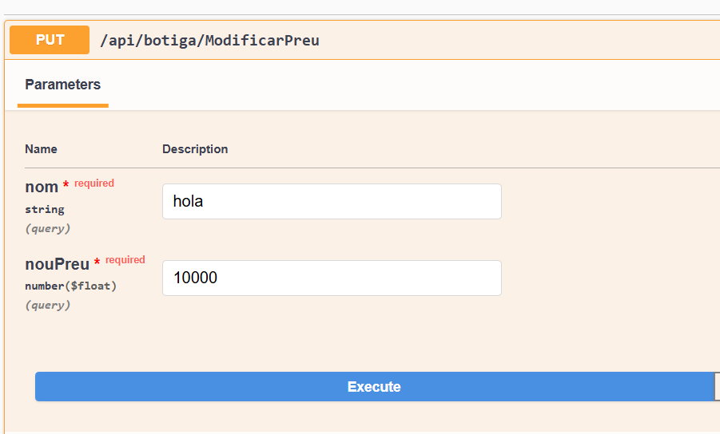
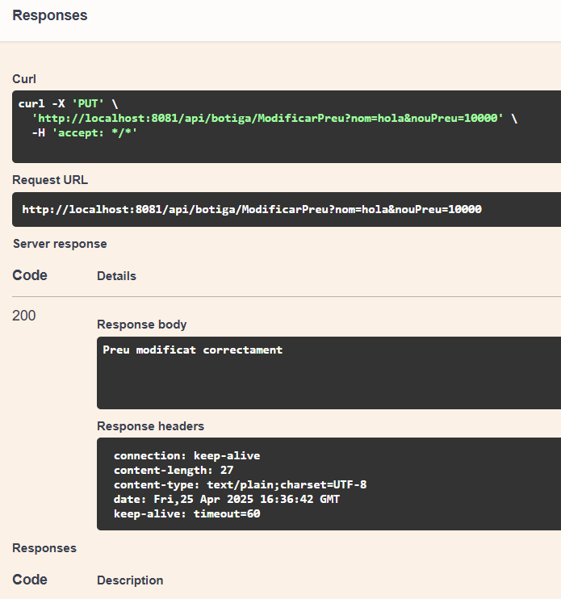
Ara si anem a revisar el producte:
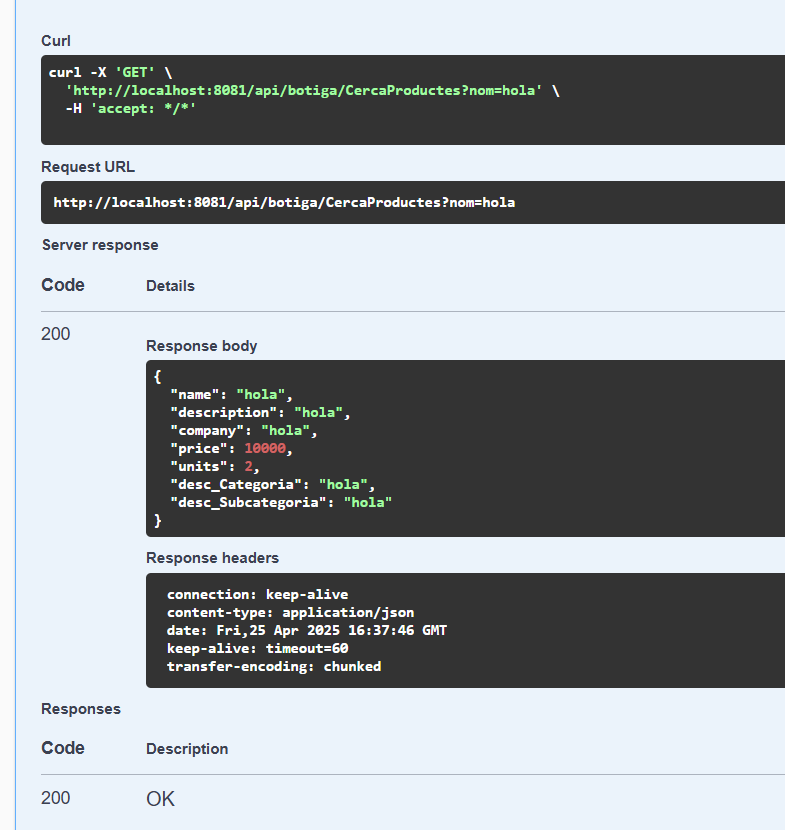
veiem el preu actualitzat
I a la base de dades el updatedAt canviat
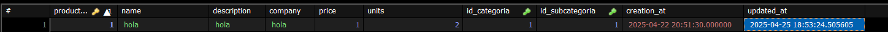
En cas de voler actualitzar un producte que no existeix:
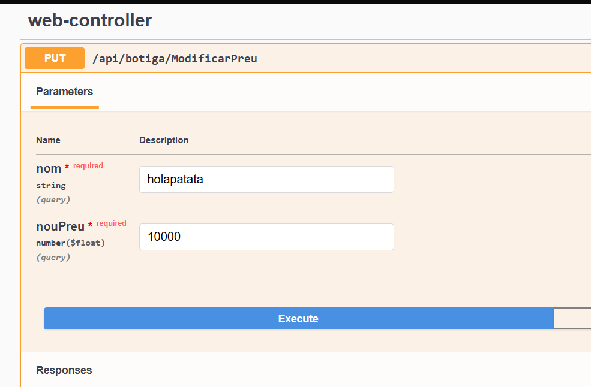
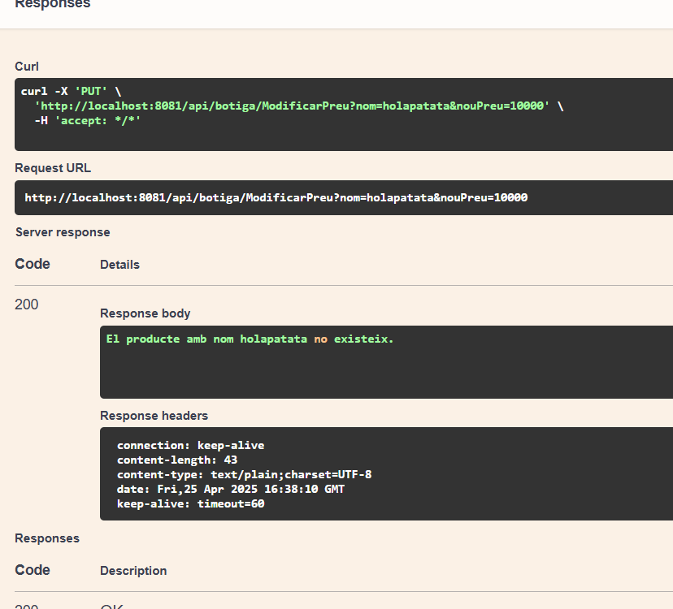
- Eliminar producte
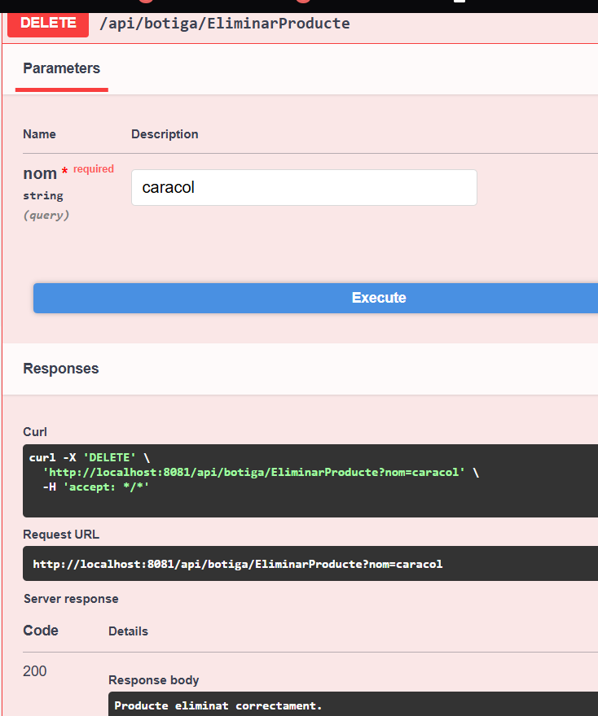
I si el cerquem podem veure que no apareix:
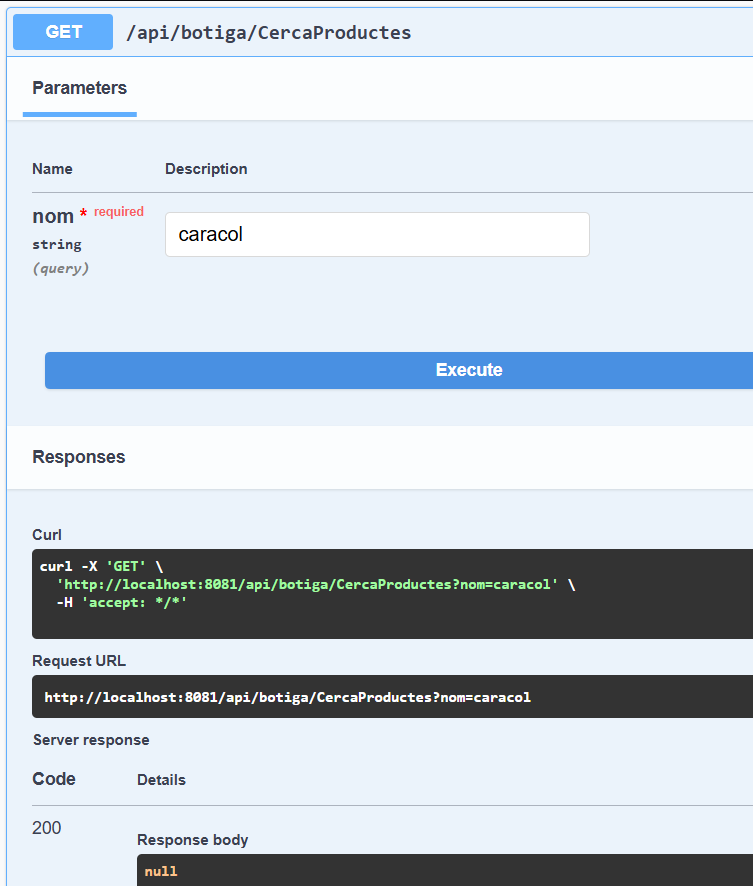
En cas que el producte a eliminar no existeixi:
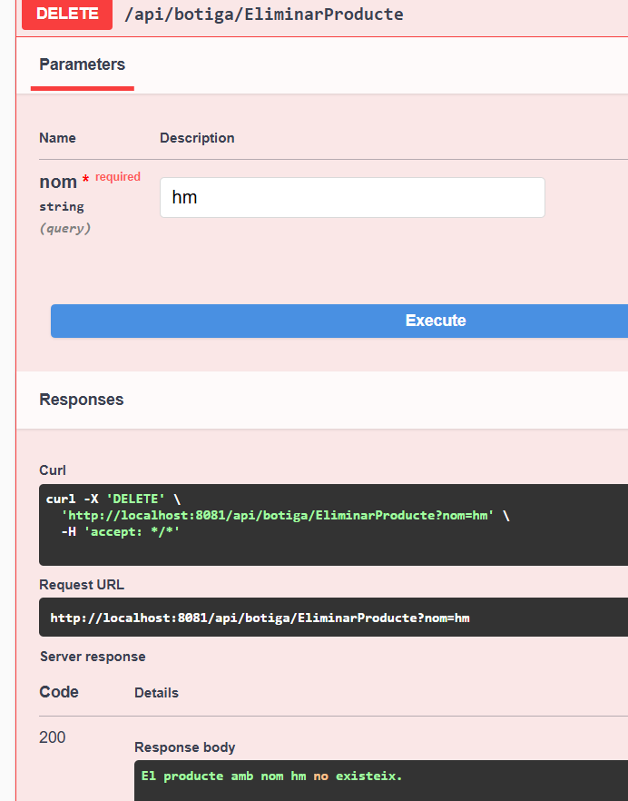
Comprovacions per Categoria:
- InserirCategoria

- LlistarCategories

- CercaCategoria
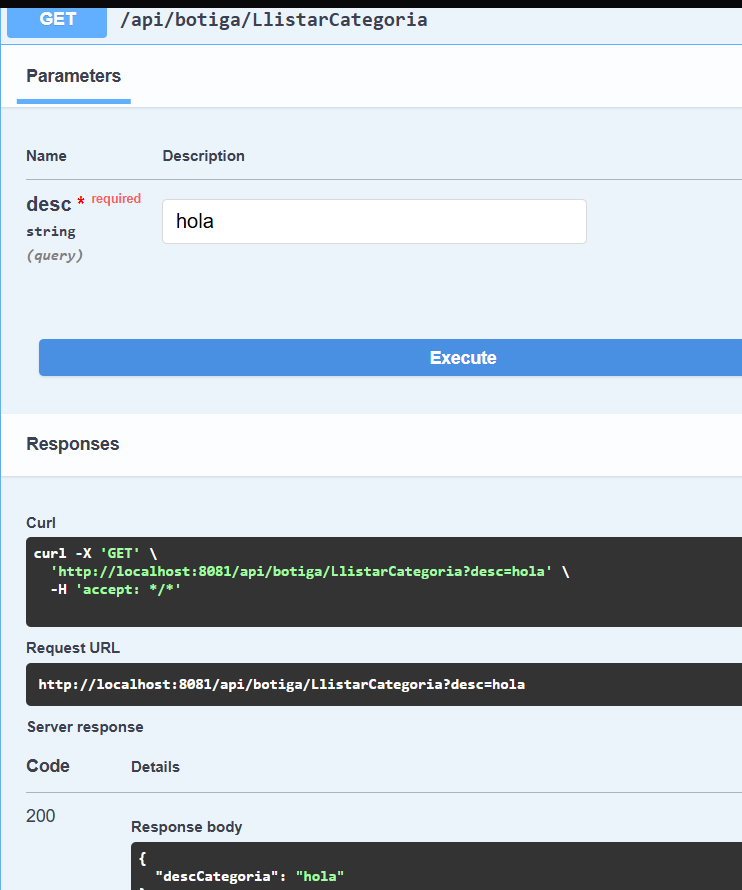
En cas que no existeixi:
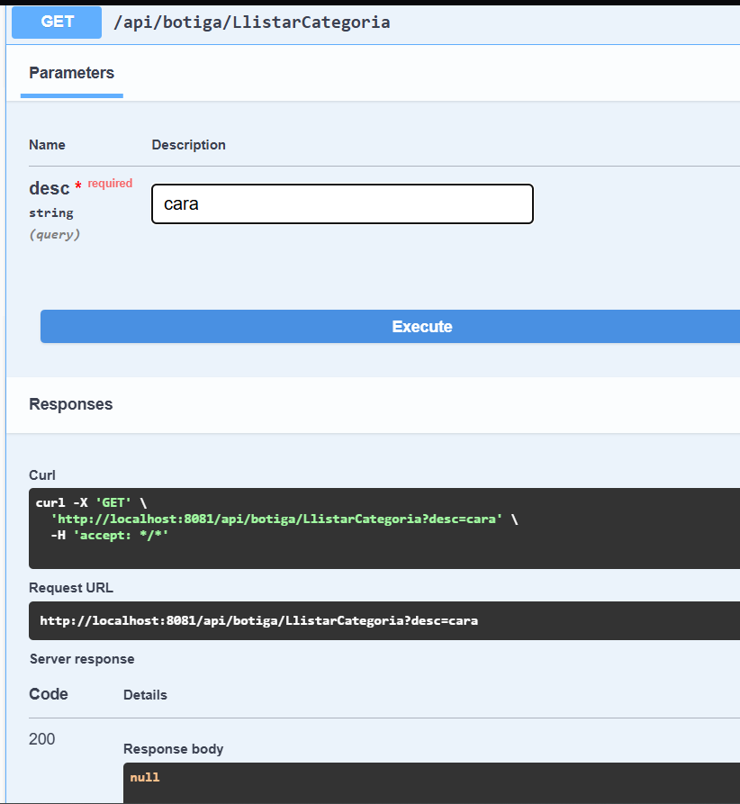
Comprovacions per SubCategoria:
- InserirSubcategoria
- LlistarSubcategories
- CercarSubcategoria

Els nostres tres endPoints extres han sigut: CercarSubcategoria, CercarCategoria i eliminarProducte