Comprovacions dels endpoints del swagger
Comprovacions per Producte:
- InserirProducte
Parametres:
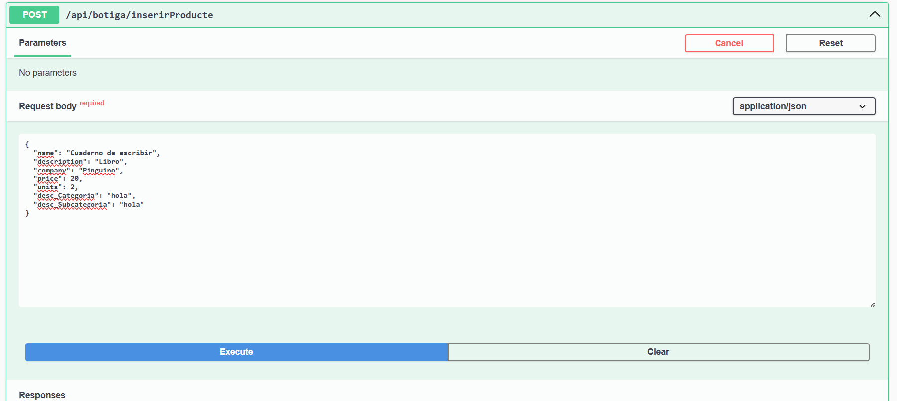
resultat:
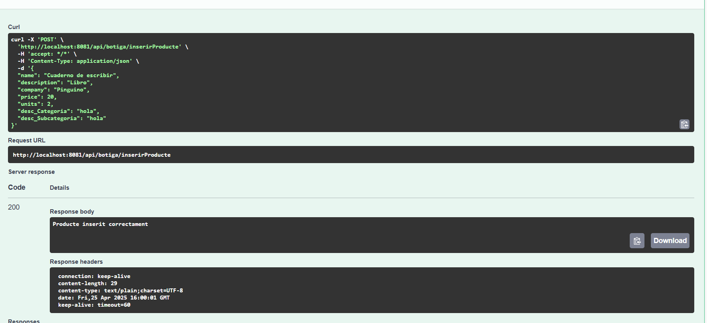
En cas que Categoria o Subcategoria no existeixi o hi hagi algun error es mostra al swagger:
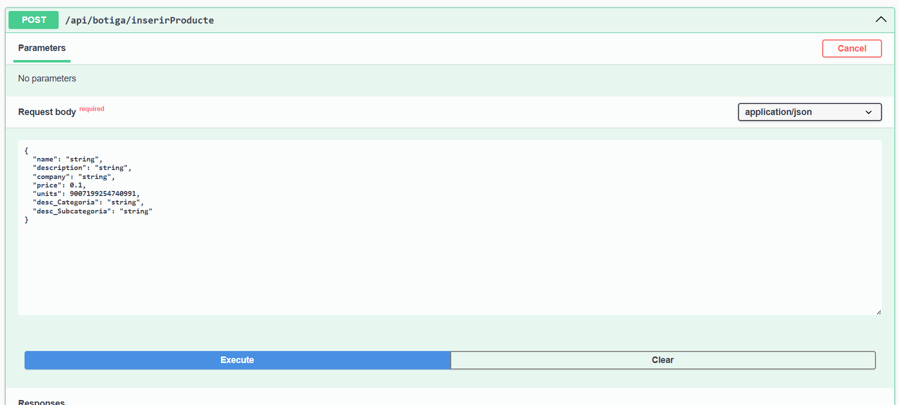
- LlistarProductes
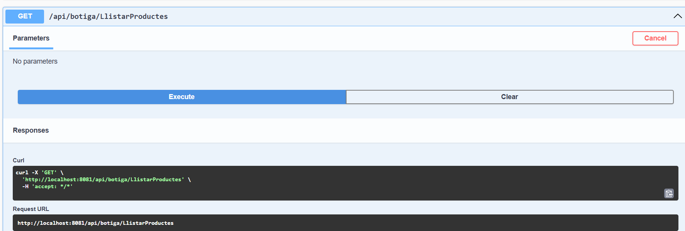
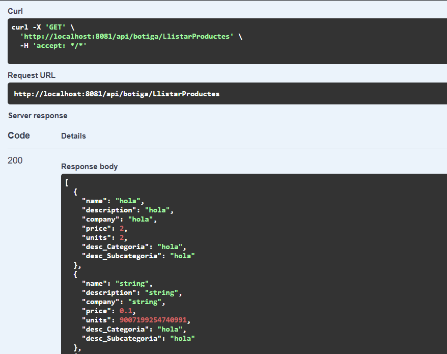
- CercaProducte
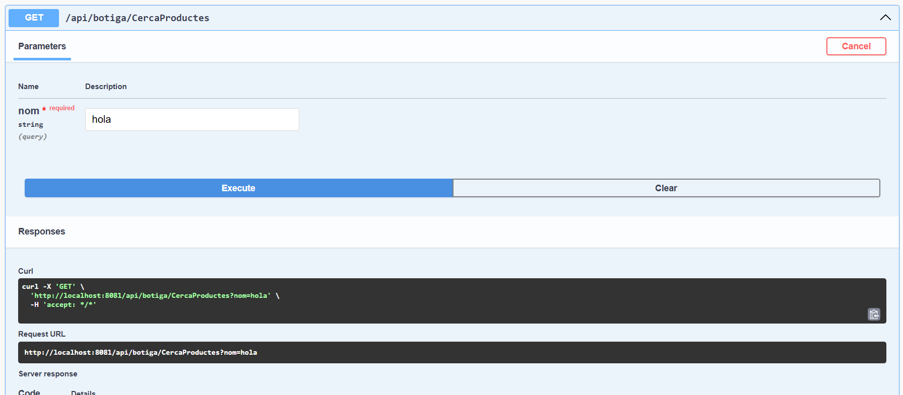
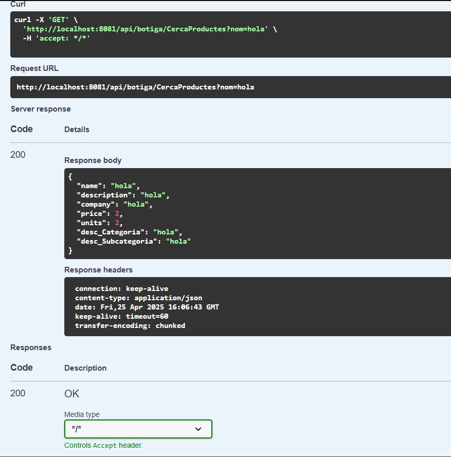
En cas que no hi hagi cap producte amb aquest nom retorna:
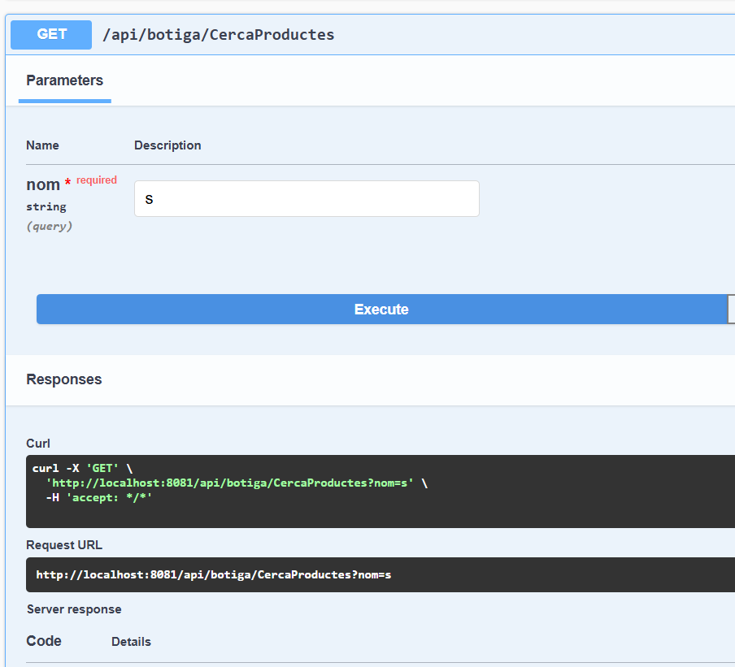
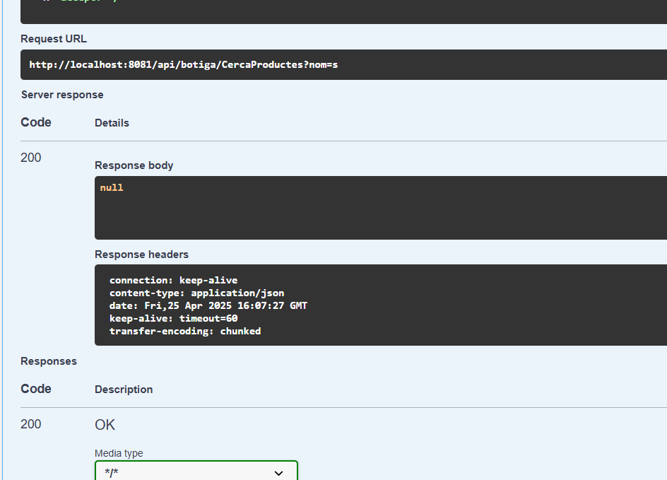
- ModificarPreu
Comprovacions per Categoria:
- InserirCategoria
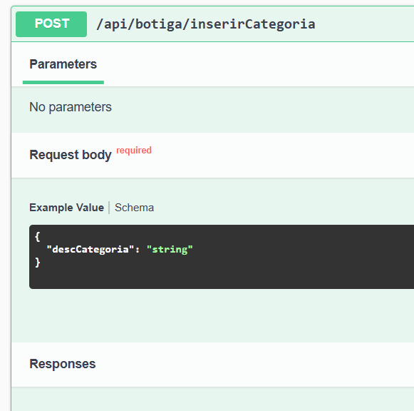
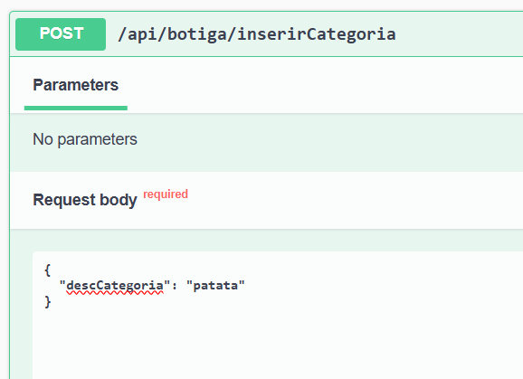
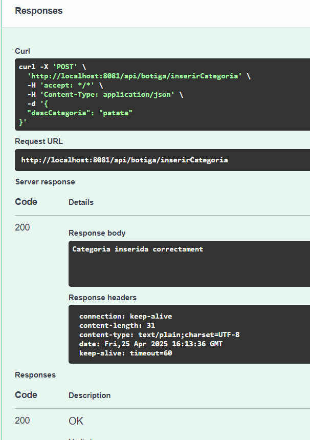
- LlistarCategories
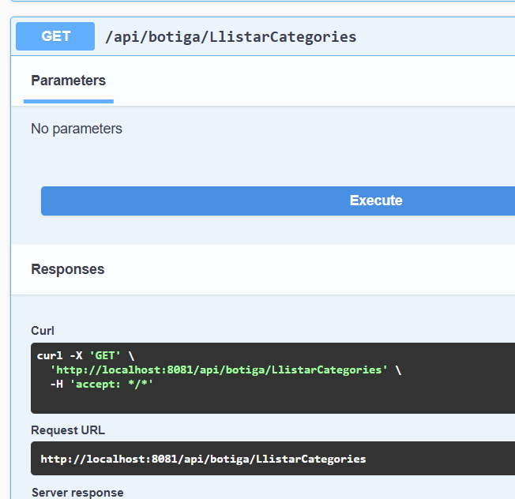
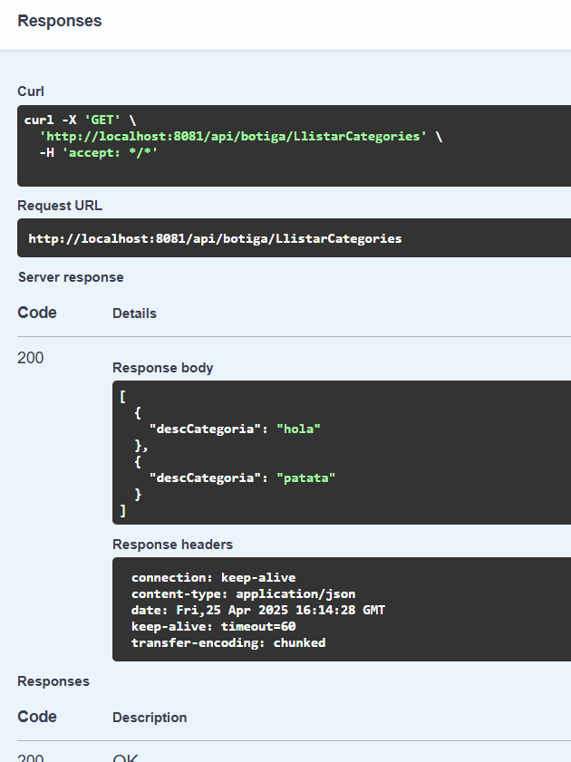
- CercaCategoria
Comprovacions per SubCategoria:
- InserirSubcategoria
- LlistarSubcategories
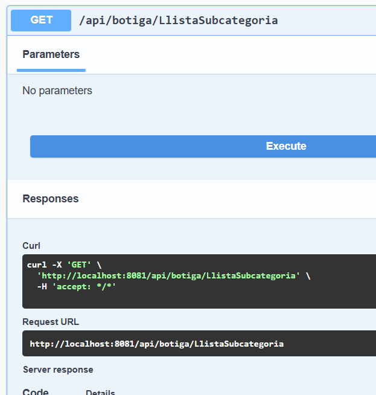
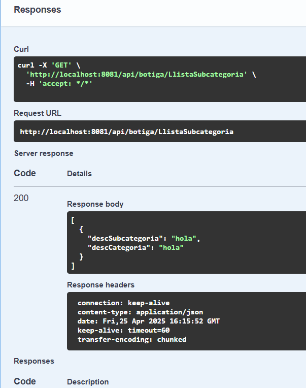
- CercarSubcategoria