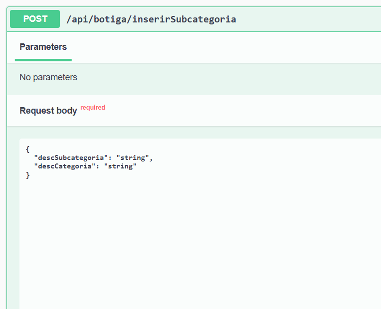
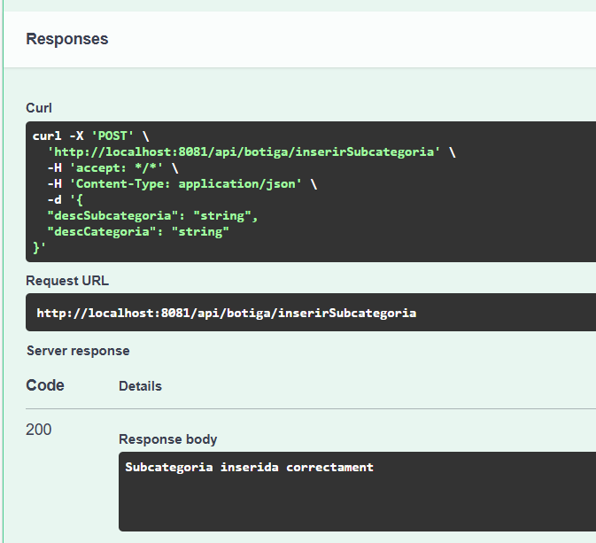
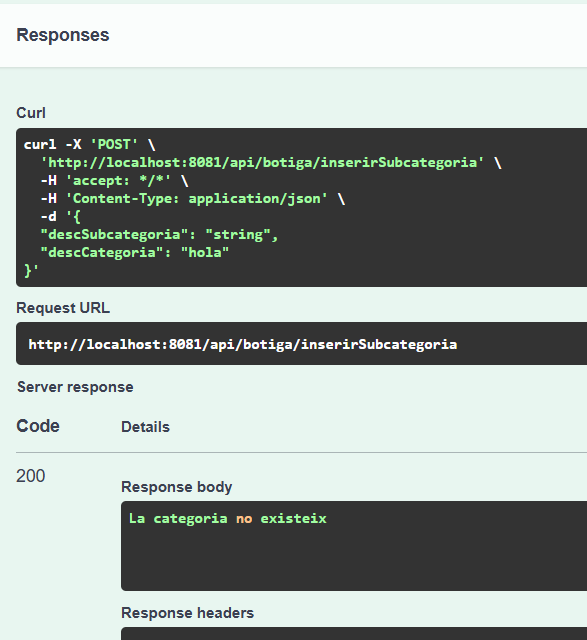
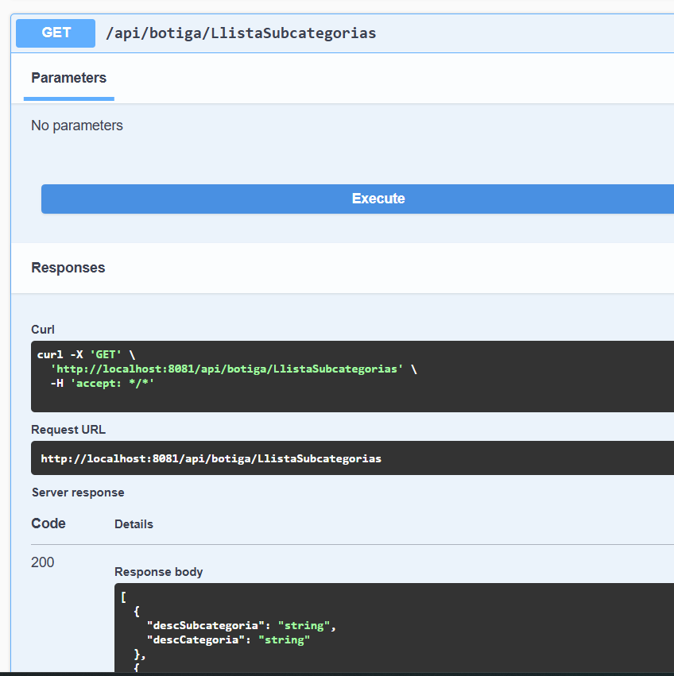
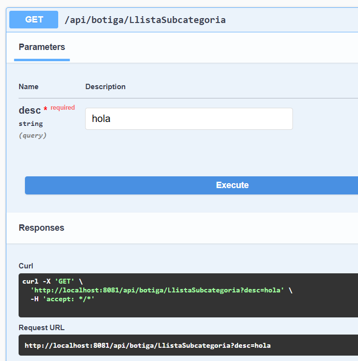
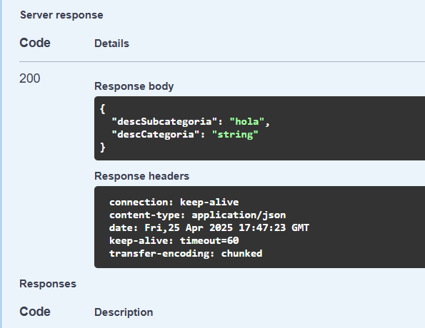
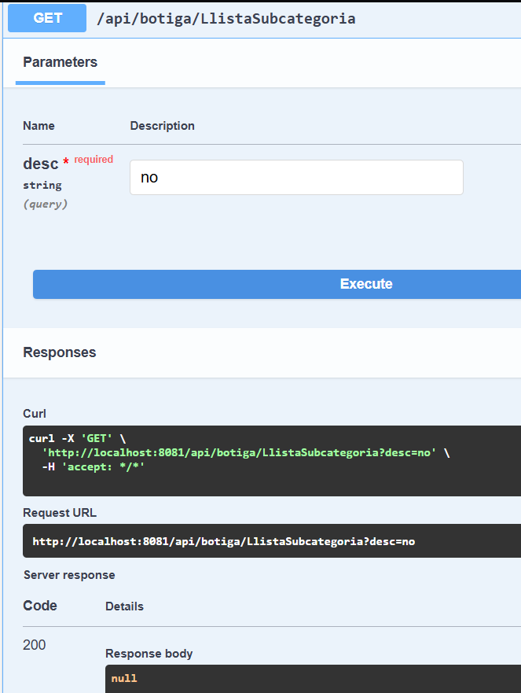

# Comprovació dels endpoints del **Swagger**

Aquest document mostra exemples reals de comprovacions dels diferents endpoints implementats per a **Producte**, **Categoria** i **Subcategoria**, així com els missatges d’error que poden aparèixer.

---

## Comprovacions per **Producte**

### Inserir Producte

**Paràmetres d’entrada:**

**Resultat esperat:**

**Errors possibles:**
- Si la **categoria** o **subcategoria** no existeixen:

---

### Llistar Productes

  

---

### Cercar Producte per nom

  

**En cas que no existeixi cap producte amb aquest nom:**

  

---

### Modificar Preu

  

**Verificació del canvi:**

- Revisant el producte:
  

- A la base de dades, el `updatedAt` ha estat modificat:
  

**En cas que el producte no existeixi:**

  

---

### Eliminar Producte

**Verificació que el producte ha estat eliminat:**

**En cas que el producte a eliminar no existeixi:**

---

## Comprovacions per **Categoria**

### Inserir Categoria
  

---

### Llistar Categories

  

---

### Cercar Categoria

**Si la categoria no existeix:**

---

## Comprovacions per **Subcategoria**

### Inserir Subcategoria

  

**Si la categoria associada no existeix:**

---

### Llistar Subcategories

---

### Cercar Subcategoria

  

**Si la subcategoria no existeix:**

---

## Endpoints extres ¡

Els tres endpoints addicionals desenvolupats han estat:

- `CercarSubcategoria`
- `CercarCategoria`
- `EliminarProducte`

---

## Possible millora

A última hora ens hem adonat que, per una millor gestió dels missatges d’error, els mètodes del `RestController` haurien de retornar `ResponseEntity`.

---
